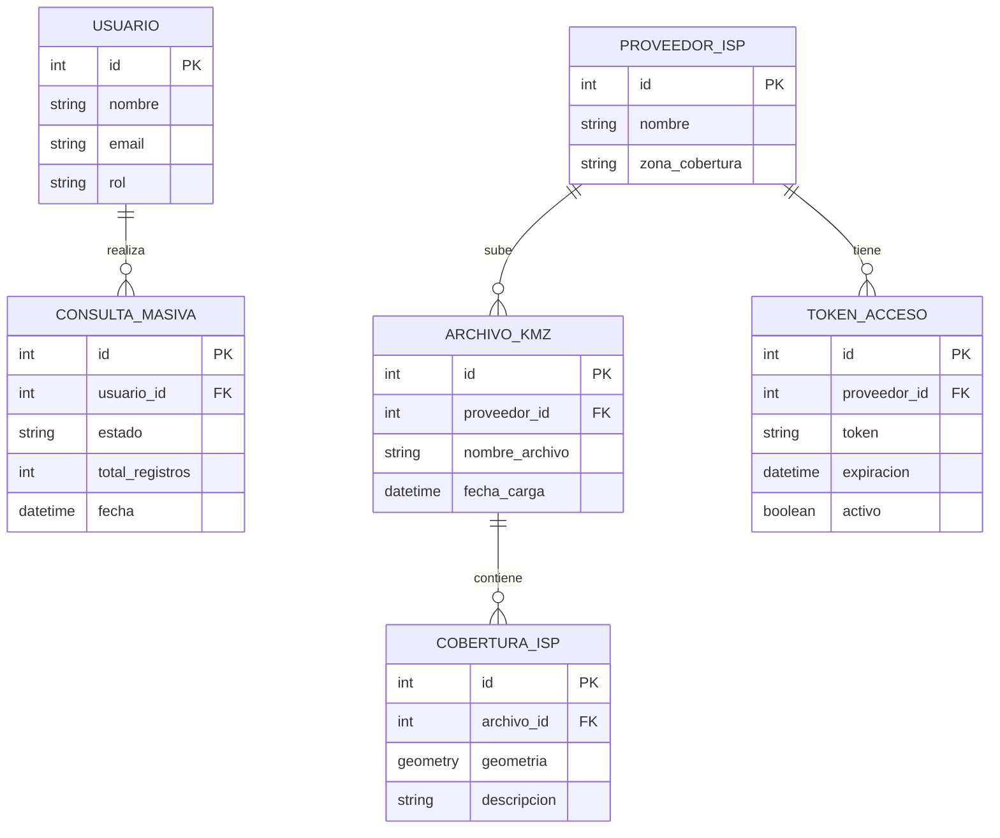
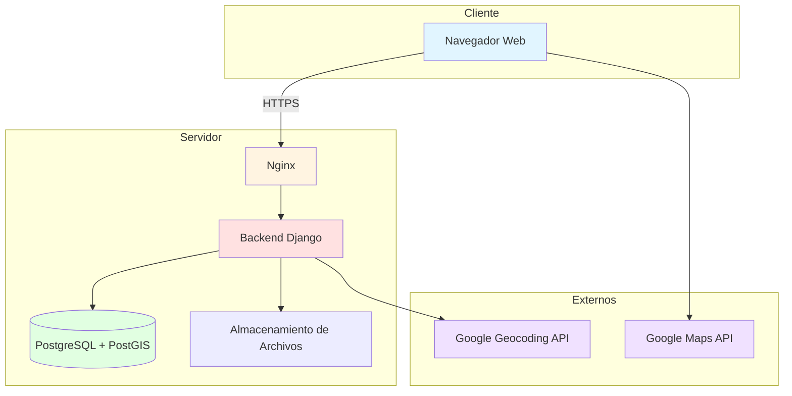

# Consultoria_ISP
Trabajo consultoria materia P2

# Diseño de la Arquitectura
## Sistema de Análisis de Cobertura ISP

---

## 1. Alcance

### Incluido en el MVP
- Carga y procesamiento de archivos KMZ por proveedor ISP
- Consulta de cobertura por coordenadas o dirección
- Consulta masiva de múltiples puntos simultáneamente
- Portal externo para que los ISPs suban sus archivos
- Visualización de cobertura en mapa interactivo
- Dashboard con estadísticas generales
- Generación de reportes de factibilidad

### Fuera del Alcance del MVP
- Análisis predictivo o machine learning
- Integración con sistemas externos (CRMs, ERPs)
- Aplicación móvil nativa
- Sistema de facturación o suscripciones
- Reportería avanzada personalizada por cliente

---

## 2. Dimensiones del Sistema y Requisitos No Funcionales

### Dimensiones

| Métrica | Estimación |
|--------|------------|
| Usuarios concurrentes | 10 – 15 |
| Peticiones por segundo (pico) | ~10 RPS |
| Registros en base de datos | ~10,000 puntos geográficos |
| Archivos KMZ activos | ~26 |
| Proveedores ISP | 4 |
| Consultas masivas | Hasta 500 registros por archivo |

### Requisitos No Funcionales

| RNF | Descripción |
|-----|-------------|
| **Rendimiento** | Consulta individual < 1s · Carga del mapa < 2s · Procesamiento masivo < 60s |
| **Seguridad** | Control de acceso por usuario · Separación de datos por ISP · Validación de archivos subidos |
| **Disponibilidad** | 99.5% de uptime mensual · Recuperación ante fallos < 2 horas |
| **Usabilidad** | Usuario nuevo productivo en < 15 minutos sin necesidad de manual |
| **Escalabilidad** | Soportar crecimiento hasta 50 usuarios y 1M registros sin rediseño |
| **Mantenibilidad** | Código modular, documentado y versionado en Git |

---

## 3. Modelado del Dominio

### Entidades Principales

- **Usuario:** Persona que accede al sistema para consultar cobertura y generar reportes.
- **Proveedor ISP:** Empresa de telecomunicaciones propietaria de la infraestructura de fibra óptica.
- **Archivo KMZ:** Archivo geográfico que contiene los datos de cobertura de un proveedor.
- **CoberturaISP:** Registro geoespacial (punto, línea o polígono) que representa infraestructura de fibra.
- **ConsultaMasiva:** Proceso de análisis de múltiples ubicaciones desde un archivo CSV.
- **TokenAcceso:** Credencial temporal que permite a un ISP subir archivos sin acceso completo al sistema.

### Diagrama Entidad-Relación

---

## 4. Descripción de los Componentes

| Componente | Descripción | Tecnologías |
|------------|-------------|-------------|
| **Frontend Web** | Interfaz de usuario: mapas interactivos, formularios de consulta y dashboard | HTML, CSS, JavaScript, Google Maps API |
| **Backend / API** | Lógica de negocio: procesamiento de KMZ, consultas geoespaciales, gestión de usuarios y reportes | Django, Python, Django REST Framework |
| **Base de Datos** | Almacenamiento relacional con soporte geoespacial para consultas de cobertura | PostgreSQL, PostGIS |
| **Servidor Web** | Manejo de peticiones HTTP, archivos estáticos y balanceo hacia el backend | Nginx, Gunicorn |
| **Almacenamiento de Archivos** | Gestión de archivos KMZ subidos y CSVs generados | Sistema de archivos del servidor |
| **Servicio de Geocodificación** | Conversión de direcciones en coordenadas geográficas | Google Geocoding API |
| **Portal ISP** | Interfaz simplificada para que proveedores suban archivos sin acceso completo | Token-based, integrado al backend |

---

## 5. Diagrama de Componentes

---

## 6. Justificación del Diseño

La arquitectura propuesta responde directamente a los requisitos no funcionales prioritarios del sistema:

- **Monolito sobre microservicios:** Dado el tamaño del equipo y el alcance del MVP (10-15 usuarios), un backend unificado reduce la complejidad operacional y acelera el desarrollo.
- **PostgreSQL + PostGIS:** Las consultas de cobertura requieren operaciones geoespaciales eficientes. PostGIS es el estándar para este tipo de análisis en bases de datos relacionales.
- **Google Maps + Geocoding API:** Ofrecen la mayor precisión en Colombia para geocodificación y una visualización familiar para el usuario empresarial.
- **Nginx como proxy:** Mejora rendimiento sirviendo archivos estáticos directamente y permite escalar workers de backend sin cambiar la capa de red.
- **Portal ISP con tokens:** Permite a los proveedores actualizar su cobertura de forma segura y sin exposición innecesaria del sistema completo.

Este diseño permite cumplir los tiempos de respuesta esperados, proteger la confidencialidad de los datos de infraestructura, y escalar progresivamente sin necesidad de rediseñar la arquitectura base.
